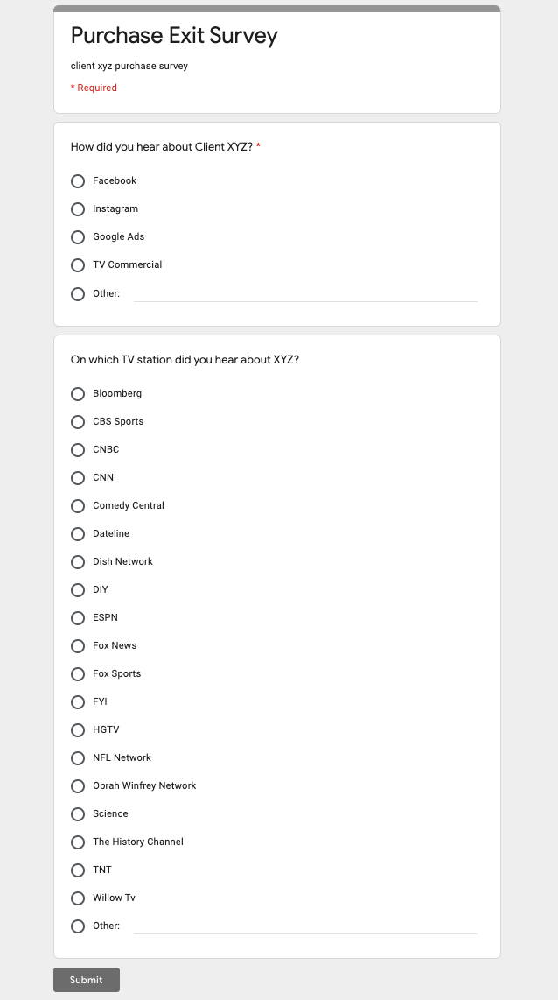

<!-- PROJECT LOGO -->

    
  </a>

  <h3 align="center">TV Network Efficiency Evaluation</h3>

  

    Creating important marketing calculations to determine how effectly a network converts a viewer into a consumer.
     
    <a href="https://github.com/Mathurkarishma/tv-networks-efficiency"><strong>Explore the docs »</strong></a>
     
     
    <a href="https://github.com/Mathurkarishma/tv-networks-efficiency/issues">Report Bug</a>
    ·
    <a href="https://github.com/Mathurkarishma/tv-networks-efficiency/issues">Request Feature</a>
  

<!-- TABLE OF CONTENTS -->

  
<h2 style="display: inline-block">Table of Contents</h2>

  <ol>
    <li>
      <a href="#about-the-project">About The Project</a>
      <ul>
        <li><a href="#built-with">Built With</a></li>
      </ul>
    </li>
    <li>
      <a href="#getting-started">Getting Started</a>
    </li>
    <li><a href="#usage">Usage</a></li>
    <li><a href="#conclusion">Conclusion</a></li>
    <li><a href="#contact">Contact</a></li>
  </ol>

<!-- ABOUT THE PROJECT -->
## About The Project

We will be speaking into 3 different datasets.  Client XYZ advertises their products on several TV networks with airing information and survey data after customers make their purchases.  We will be reviewing these using a lookup table and ultimately put it into a report format through Python.  There will be guidance on the cost to acquire a customer through TV and the most cost-efficient networks so Client XYZ can determine where to increase or decrease spending.  The survey looks like the below image.

### Built With

* [Python](https://www.python.org/)
* [Spyder](https://www.spyder-ide.org/)

<!-- GETTING STARTED -->
## Getting Started

To get a local copy up and running, download the `Analyst_Dataset` Excel file and the `TV_Networks` Python file. Then run the code in an IDE software, such as Spyder.  Save them in the same folder.

<!-- USAGE EXAMPLES -->
## Usage

The code guides you through the following:

1. Impo

<!-- CONCLUSION -->
## Conclusion

The 

<!-- CONTACT -->
## Contact

Karishma Mathur - karishma324@gmail.com

Project Link: [https://github.com/Mathurkarishma/tv-networks-efficiency](https://github.com/Mathurkarishma/tv-networks-efficiency)
